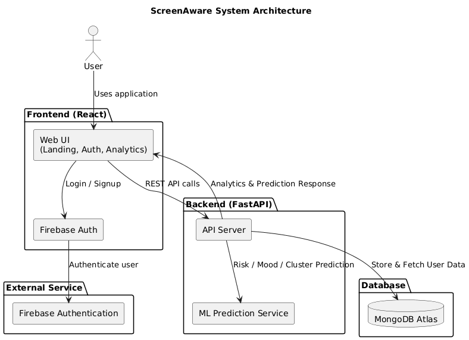

# ScreenAware

A digital wellness platform that helps users monitor and improve their screen time habits with actionable insights.

## Features
- Personalized wellness tips with filtering options
- Analytics dashboard with data visualizations
- Mental health risk prediction using machine learning
- Firebase authentication for secure access

---

## 🏗 System Architecture

ScreenAware follows a **modern full-stack architecture** with clear separation between frontend, backend, machine learning, and database layers.

### High-Level Architecture Diagram



### Architecture Overview
- **Frontend (React.js)**  
  Handles user interaction, authentication flow, analytics dashboards, and wellness tips UI.

- **Authentication (Firebase)**  
  Manages secure login and signup using Firebase Authentication.

- **Backend (FastAPI)**  
  Acts as the central API layer, handling business logic, analytics processing, and communication with ML services and the database.

- **Machine Learning Service**  
  Performs mental health risk prediction, mood analysis, and user clustering using pre-trained models.

- **Database (MongoDB Atlas)**  
  Stores user data, analytics records, and prediction results.

---

## Installation
1. Clone this repository.
2. Navigate to the `frontend` directory and install dependencies:
   ```bash
   npm install
   ```
3. Start the frontend:
   ```bash
   npm start
   ```
4. Navigate to the `backend` directory and install dependencies:
   ```bash
   pip install -r requirements.txt
   ```
5. Start the backend:
   ```bash
   uvicorn backend.app.main:app --reload
   ```

## Tech Stack
- **Frontend**: React.js, Recharts, Firebase
- **Backend**: FastAPI, scikit-learn
- **Machine Learning**: Data preprocessing and predictive modeling


